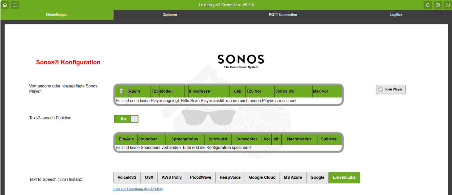
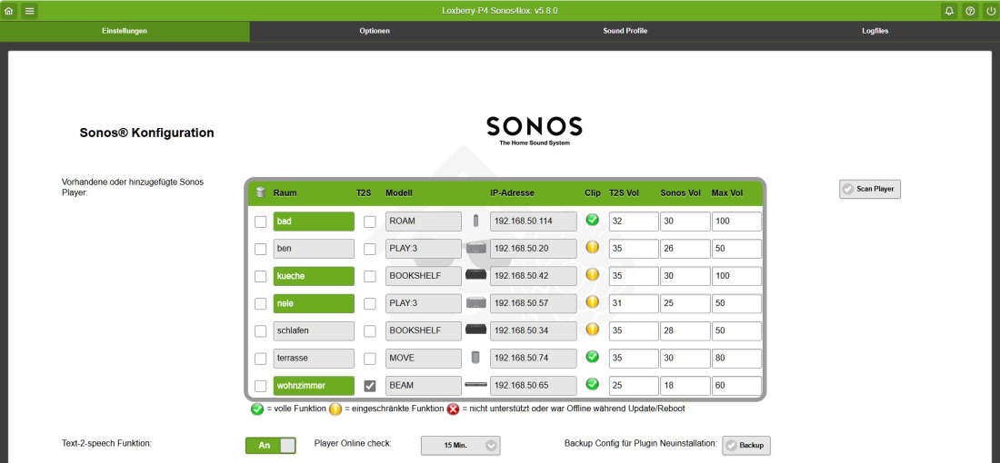
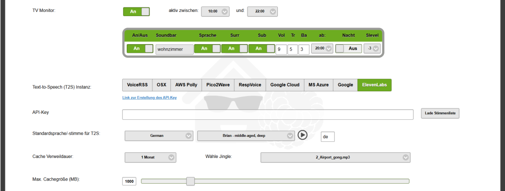
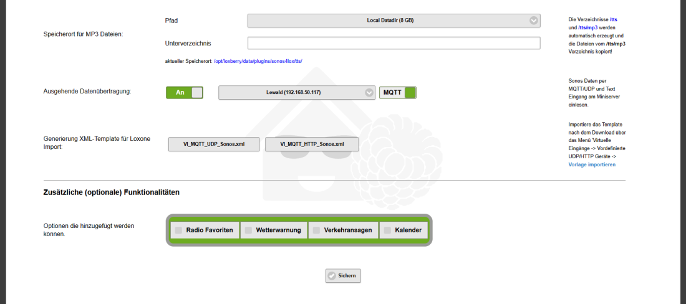

# Zonen hinzufügen

## Sonos-Zonen hinzufügen

 

Durch Betätigen des Buttons "Scan Zonen" durchsucht das Plugin dein Netzwerk nach vorhanden Sonos Playern. Dabei werden Bridge, Dock, Boost und Subwoofer nicht berücksichtigt.

:::info

Bitte vorher unbedingt sicherstellen das alle Player ONLINE sind!

:::

Nach erfolgtem Scan sollte folgender Bildschirm erscheinen:

 
 
 

Falls nach dem Scan keine Player erscheinen überprüfe dein Netzwerk (Fritzbox, Switch, Firewall, Virenscanner etc.) ob Mulitcast enabled ist. Eigentlich sollte das im Standard der Fall sein, aber gerade Virenscanner und managed Switches haben Multicast zum Teil disabled.

## Security (VLAN)

Aufgrund der Nutzung des CIFS Netzwerkprotokolls für T2S kann es für Betreiber mehrerer VLAN's notwendig sein die TCP Ports **137-139** und **445** in der Firewall zu öffnen

Das Skript sucht basierend auf dem SSDP Protokoll nach UPnP Devices mit folgender Multicast Adresse: 239.255.255.250 Port:1900. Dieser Port muss nicht explizit im Router konfiguriert werden!

## Raum-Einstellungen

Die Angaben für Raum und Modell sind NICHT änderbar und sind analog zur Sonos App. Falls eine Zone in der Sonos App umbenannt wird, muss anschließend in der Konfiguration der alte Eintrag gelöscht werden (Tick-box vor der jeweiligen Zone) und speichern, dann erneut einen Scan ausführen um die umbenannte Zone zu finden. Das gleiche gilt auch für neu hinzugefügte Player.

Wenn du einen Player aus irgendeinem Grund löschen möchtest, markiere die Tick-Box des entsprechenden Players und speichere die Konfiguration. Solange du nicht wieder den Scan Button betätigst ist die Zone für den MS nicht mehr erreichbar.

Als nächsten Schritt müssen folgende 3 Werte je Zone/Player ergänzt werden:

  * **T2S:** Player der für T2S Emergency Anouncements verwendet werden soll
  * **T2S Volume:** Der eingegebene Wert (zwischen 0-100) ist die Standard Lautstärke für T2S Durchsagen für diese Zone.
  * **Sonos Volume:** Der eingegebene Wert (zwischen 0-100) ist die Standard Sonos Lautstärke für diese Zone.
  * **Sonos maximal Volume:** Der eingegebene Wert (zwischen 0-100) ist die maximale Sonos Lautstärke für diese Zone.

Die Spalte **Clip** gibt an ob der entsprechende Player die T2S AudioClip Funktion unterstützt.

Standard bedeutet dass ohne Angabe von Volume innerhalb der Syntax diese Lautstärkewerte genommen werden. Näheres über die Verwendung von Volume in der Syntax findest du im Kapitel "Syntax".

Erst nach erfolgreicher Ergänzung dieser Werte lässt sich das Plugin speichern.