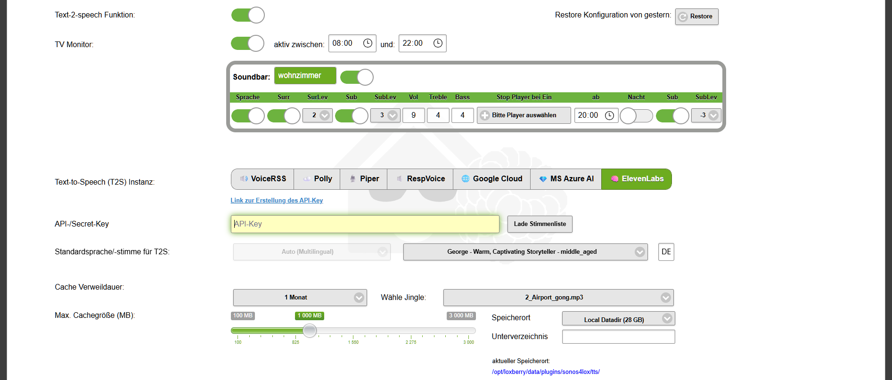
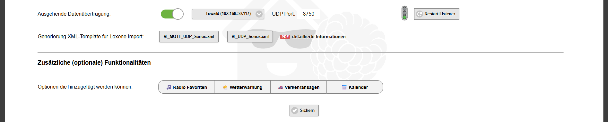

# Text-to-speech (T2S)

 

## Text-to-speech Engine

Um die speech Funktionen nutzen zu können benötigt man eine Speech Engine, diese kann entweder Online oder Offline sein. Folgende T2S Optionen stehen zur Auswahl:

| Engine | Typ | Hinweis |
| --- | --- | --- |
| **VoiceRSS** | Online | Nur API Key erforderlich, eine weibliche Stimme |
| **Amazon Polly** | Online | API Key + Secret Key; **Preismodell beachten** |
| **Piper TTS** | Offline | KI-basiert (ONNX), siehe [Piper TTS](#piper-tts-offline) |
| **ResponsiveVoice** | Online | Kein Key erforderlich, eine weibliche Stimme |
| **GoogleCloud** | Online | API Key, multilingual, Stimmenauswahl; **Preismodell beachten** |
| **MS Azure** | Online | API Key, multilingual, Stimmenauswahl; **Preismodell beachten** |
| **ElevenLabs** | Online | KI-basiert, multilingual, Stimmenauswahl; **Preismodell beachten** → **Empfehlung** |

Nach erfolgreichem Generieren der entsprechenden Key(s) müssen diese in den entsprechenden Feldern eingetragen werden. Über den Link "**Link zur Erstellung des API-Key**" gelangt man direkt zum jeweiligen Anbieter.

## Weitere Einstellungen

**Text-to-speech Funktion:** Die T2S Funktion kann temporär ausgeschaltet werden (default = ON). Ausnahme: Eine T2S wird mit dem Parameter **&urgent** ausgeführt, dann wird die T2S bei ausgeschalteter Funktion trotzdem ausgegeben.

**API-/Secret-Key:** Bitte den gültigen API Key von VoiceRSS/Google Cloud/MS Azure/ElevenLabs bzw. API und Secret Key von AWS Polly eingeben.

**Auswahl der Standardstimme (Azure/Google Cloud/Polly/ElevenLabs):** Nach Klick auf "**Lade Stimmenliste**" Sprache und Stimme wählen. Die Stimme, als auch die Sprache, kann innerhalb der Syntax für T2S jederzeit überschrieben werden.

**Verweildauer der MP3 Dateien:** Anzahl der Tage oder Cache Größe die eine MP3 gespeichert werden soll bevor Sie automatisch gelöscht wird.

**Dateiname für Jingle MP3:** Name der Datei die vor einer Durchsage abgespielt werden soll. Diese Datei muss in das Unterverzeichnis **/tts/mp3** kopiert werden. Als Beispiel ist die Datei `2_Airport_gong.mp3` bereits enthalten. Näheres zur Nutzung unter [T2S-Durchsagen](../03-integration/actions-t2s.md).

 

**Sonos Daten senden (Ausgehende Datenübertragung):** Schalter um verschiedenste Infos an Loxone per UDP/MQTT, und Titel/Interpret Informationen über virtuelle Texteingang Verbinder zu senden. Näheres unter [Loxone-Anbindung](../03-integration/loxone.md).

**Kommunikation** zum Miniserver entweder per UDP oder MQTT-UDP.

**UDP-Port:** Bei UDP ohne MQTT den Port des MS angeben an den die UDP Pakete geschickt werden sollen und in der Firewall freigeben.

## Piper TTS (Offline)

Piper TTS ist eine reine Offline-Engine basierend auf ONNX-KI-Spezifikationen. Bei der Installation werden 3 männliche Stimmen installiert:

  * _Thorsten Neutral_
  * _Thorsten Emotional_
  * _Thorsten Hessisch_

Weitere Stimmen können über [HuggingFace](https://huggingface.co/rhasspy/piper-voices/tree/main) heruntergeladen werden (je eine **.onnx** und **.json** Datei) und ins Verzeichnis `loxberry/webfrontend/html/plugins/sonos4lox/voice_engines/piper-voices` kopiert werden. Alternativ dem Link in der Plugin Konfiguration folgen.

Bei der **emotionalen Stimme** kann über den Parameter **`&speaker=<WERT>`** eine von 8 Emotionen gewählt werden:

| Wert | Emotion |
| --- | --- |
| 0 | fröhlich |
| 1 | wütend |
| 2 | angewidert |
| 3 | betrunken |
| 4 | neutral |
| 5 | schläfrig |
| 6 | überrascht |
| 7 | flüsternd |
