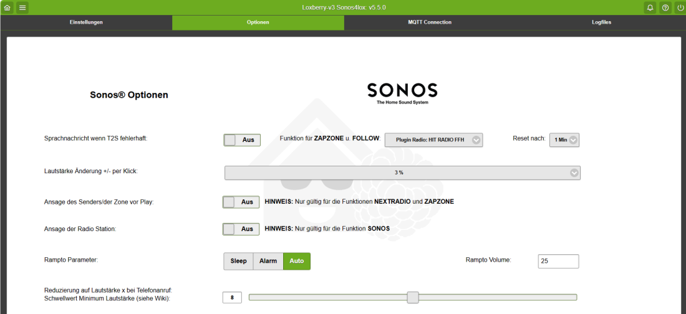
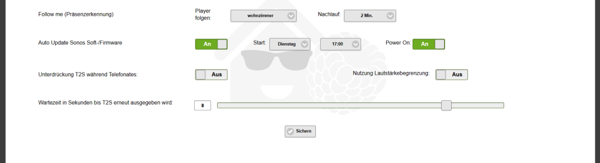

# Optionen

 
 

## Sprachnachricht T2S fehlerhaft

Gibt eine T2S aus falls die Standardausgabe nicht prozessiert wurde.

## Lautstärke Änderung per Klick

Hier handelt es sich um eine typische Tasterfunktion um die Lautstärke einer Zone zu ändern. Der hier angegebene Wert erhöht/verringert in den jeweilig angegebenen Sprüngen die Lautstärke.

## Ansage der Radio Station

Bei der Funktion **say&sonos** kann zwingend die Ansage des aktuell laufenden Senders vorgegeben werden

## Lautstärkeanhebung

Bei den Funktionen **nextradio** und **zapzone** gibt es optional die Möglichkeit den Titel/Interpret/Radio Sender vorm abspielen ansagen zu lassen (nur bei Single Playern, nicht für Gruppen). Dabei kann es sein das die Ansagelautstärke u.U. zu leise ist. Durch Anpassen des Schiebereglers kann diese etwas lauter eingestellt werden.

## Rampto Parameter

Rampto ist eine Funktion zum langsamen, kontinuierlichem Erhöhen der Lautstärke. Es stehen 3 verschiedene Parameter zur Verfügung die alle leider nicht in der Laufzeit konfigurierbar sind:

  - _Sleep_ → erhöht UND verringert die Lautstärke langsam innerhalb von ca. 17 Sekunden auf die gewünschte Lautstärke (typische Weckeinstellung)
  - _Alarm_ → erhöht zügig und kontinuierlich die Lautstärke auf den gewünschten Wert.
  - _Auto_ → erhöht relativ schnell die Lautstärke auf den gewünschten Wert.

Bsp: Die Zone steht auf Pause und die Funktion Play wird betätigt. Ist die gegenwärtige Lautstärke < 25 greift der Rampto Parameter und erhöht gemäß der Konfiguration die Lautstärke, ist der Wert darüber geht es mit diesem Lautstärkewert unvermittelt los.

## Rampto Volume

Schwellwert der angegebenen oder gerade laufenden Lautstärke unterhalb dessen einer der 3 zur Verfügung stehenden Parameter automatisch greifen soll.

## Lautstärke bei Anruf

Wert auf den die Lautstärke bei Anruf (Fritz.box) zügig reduziert werden soll

## Unterdrückung T2S während Telefonates

Bei Ein wird eine evtl. anfallende T2S während eines Anrufes blockiert

## Wartezeit bis T2S erneut ausgegeben wird

Zeit innerhalb der eine T2S nicht ein 2. Mal ausgegeben werden soll (Notwendig für T2S aus dem Statusbaustein)