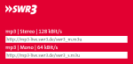

# Einstellungen

## Radio-Favoriten für Tasterbedienung

Hierbei handelt es sich auch um eine typische Tasterfunktion mit Hilfe derer man durch einen jeweiligen Tastenklick sich durch seine Radiofavoriten durchzappen kann. Ist das Script am Ende der Liste angekommen beginnt es wieder von vorne. Die URL Daten für deine Favoriten werden folgendermaßen ermittelt:

Suche dir deine(n) Sender im Internet (z.B.: google.com und dann Schlagworte "SWR3 URL stream"). Kopiere dann die gewünschte Stream URL ins Feld "**Sender URL**" und gebe bei "**Sender Name**" den Sendernamen ein. Achte bitte darauf das nur Streams die mit **http:%%//%%** beginnen genutzt werden können und folgende Zeichen nicht Bestandteil der URL sein dürfen ? { } | & ~ ! [ ] ( ) ^ " =

> __Beispiel:__ Für SWR3 wäre die URL für 128 kBit/s Qualität dann `http://mp3-live.swr3.de/swr3_m.m3u`
>
> 

Weitere Sender findet man hier: [https://streamurl.link/](https://streamurl.link/)

Der entscheidende Vorteil liegt in der Sonos unabhängigen URL Struktur und des daraus resultierenden Performance Zuwachs beim Wechseln der Sender.

Diese Schritte musste du für jeden deiner Favoriten Sender erneut durchführen.

### Gimmick am Rande

Als Sender Name kannst du auch irgendwas anderes eingeben (z.B. "Namen deiner Frau> Lieblingssender" um deine Frau zu überraschen. Der Name erscheint dann auch automatisch in der Sonos App.

Wenn alle Parameter ergänzt wurden speichere bitte die Konfiguration und teste die erfolgreiche Installation als erstes im Browser bevor es an die Loxone Integration geht.

Dafür kopierst du aus dem Bereich Syntax einen Befehl, ergänzt die Zone und solltest dann eigentlich etwas hören. Nur nicht bitte Play wenn in der entsprechenden Zone weder Radio noch eine Playliste geladen ist.

<!-- Weitere Details zum Umgang mit den Radio-Favoriten sowie Playlisten, Diensten und lokalen Dateien findest du unter [[plugins:sonos4loxone:playlisten_radio_dienste_lokale_dateien|Playlisten / Radio / Dienste / lokale Dateien]]. -->

## Wetterwarnungen

> TBD

## Verkehrsmeldungen

> TBD

## Kalender

> TBD