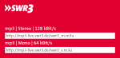

# Einstellungen

Die folgenden optionalen Bereiche werden im Tab "Einstellungen" über die Buttons **🎵 Radio Favoriten**, **🌤️ Wetterwarnung**, **🚗 Verkehrsansagen** und **📅 Kalender** ein- bzw. ausgeblendet.

## Radio-Favoriten für Tasterbedienung

Hierbei handelt es sich auch um eine typische Tasterfunktion mit Hilfe derer man durch einen jeweiligen Tastenklick sich durch seine Radiofavoriten durchzappen kann (**nextradio**). Ist das Script am Ende der Liste angekommen beginnt es wieder von vorne. Einzelne Sender können auch direkt per **pluginradio** aufgerufen werden (siehe [Radio-Befehle](../03-integration/actions-playback.md#radio-befehle)).

Je Sender werden folgende Felder gepflegt:

  * **Sender Name:** Name des Senders (wird auch in der Sonos App angezeigt und ist der Wert für `&radio=`)
  * **Sender URL:** Stream-URL des Senders
  * **Cover URL:** (optional) URL eines Bildes, das als Cover angezeigt wird

Die URL Daten für deine Favoriten werden folgendermaßen ermittelt: Suche dir deine(n) Sender im Internet (z.B.: google.com und dann Schlagworte "SWR3 URL stream"). Kopiere dann die gewünschte Stream URL ins Feld "**Sender URL**" und gebe bei "**Sender Name**" den Sendernamen ein.

:::warning

Sender Name, Sender URL und Cover URL dürfen **kein Komma** enthalten.

:::

> __Beispiel:__ Für SWR3 wäre die URL für 128 kBit/s Qualität dann `http://mp3-live.swr3.de/swr3_m.m3u`
>
> 

Weitere Sender findet man hier: [https://streamurl.link/](https://streamurl.link/)

Der entscheidende Vorteil liegt in der Sonos unabhängigen URL Struktur und des daraus resultierenden Performance Zuwachs beim Wechseln der Sender.

### Gimmick am Rande

Als Sender Name kannst du auch irgendwas anderes eingeben (z.B. "Namen deiner Frau> Lieblingssender" um deine Frau zu überraschen. Der Name erscheint dann auch automatisch in der Sonos App.

Wenn alle Parameter ergänzt wurden speichere bitte die Konfiguration und teste die erfolgreiche Installation als erstes im Browser bevor es an die Loxone Integration geht.

Dafür kopierst du aus dem Bereich Syntax einen Befehl, ergänzt die Zone und solltest dann eigentlich etwas hören. Nur nicht bitte Play wenn in der entsprechenden Zone weder Radio noch eine Playliste geladen ist.

## Wetterwarnungen

Grundlage für die T2S-Funktionen `&warning` (Wetterwarnung des Deutschen Wetterdienstes, nur Deutschland) und `&pollen` (Pollenflug).

  * **Bundesland / Region:** Auswahl des Bundeslandes (baw, bay, bbb, hes, mvp, nib, nrw, rps, sac, saa, shh, thu)
  * **Stadt oder Gemeinde:** Name der Stadt/Gemeinde, wie beim DWD geführt

Über die Links "**Wetterwarnung Standort prüfen**" und "**Pollenflug Standort prüfen**" kann geprüft werden, ob für den Ort Daten verfügbar sind. Syntax siehe [Sonderfunktionen T2S](../03-integration/actions-t2s.md#sonderfunktionen-t2s).

## Verkehrsmeldungen

Grundlage für die T2S-Funktion `&distance` (Fahrzeit zu einem Ziel über die Google Distance Matrix API).

  * **Google (distance-to-matrix API):** API Key von Google (Distance Matrix API muss freigeschaltet sein)
  * **Land / Stadt / Dorf / Gemeinde:** Startort
  * **Adresse:** Startadresse

## Kalender

Die Kalenderfunktionen basieren auf dem **CalDAV-4-Lox Plugin**, das installiert und eingerichtet sein muss.

  * **Abfallkalender:** URL des CalDAV-4-Lox Plugins für den Abfallkalender (Ausgabe JSON) – Grundlage für `&abfall`
  * **Kalender:** URL des CalDAV-4-Lox Plugins für einen Kalender (Ausgabe ICS, muss den Parameter `&events=` enthalten) – Grundlage für `&calendar`

Beide URLs werden bei der Eingabe direkt auf Gültigkeit geprüft.
