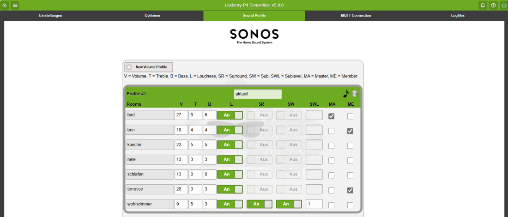
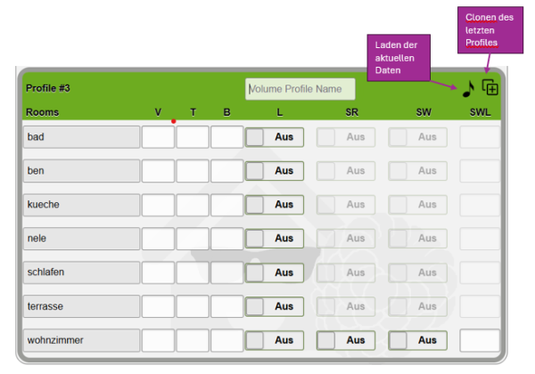

# Sound-Profile

## Definition

Sound Profile sind reine Audio Profile die zur klangtechnischen Optimierung von Streaming Diensten genutzt werden können. Es können bis zu 10 unterschiedliche Profile im Plugin angelegt werden die anschließend in der Syntax für Playlisten/Radio/Streaming genutzt oder auch durch eine Syntax auf aktuell laufende Audio angewendet werden können. Es spielt keine Rolle ob sich die Player in einer Gruppe befinden oder als Single Player.

Je Player und Profil können folgende Einstellungen vorgegeben werden:

  * **Volume**: Wert 0 bis 100
  * **Höhen**: Wert -10 bis 10
  * **Bass**: Wert -10 bis 10
  * **Loudness**: Ein/Aus
  * **Surround**: Ein/Aus (_falls ein Surround-System konfiguriert_)
  * **Subwoofer:** Ein/Aus (_falls Subwoofer vorhanden_)
  * **Subwoofer Level**: Wert -15 bis 15
  * **Master:** Der Master einer Gruppe von Playern
  * **Member:** Angeschlossene Member einer Gruppe

 

:::info

Für **Text-to-speech** sind die Profile **nicht** nutzbar!

:::

## Erstkonfiguration

Beim Erstaufruf des Tabs "Sound Profile" werden je Player die aktuellen Einstellungen/Werte ausgelesen und gespeichert. Um ein weiteres Profil zu erstellen auf "**New Volume Profile**" klicken, dann wird ein leeres Volume Profile erstellt. Um nicht wieder alles eingeben zu müssen kann man entweder:

  * _die aktuellen Einstellungen/Werte auslesen_
  * _das letzte gespeicherte Profil clonen und dann entsprechend anpassen_

Erfahrungsgemäß ist es einfacher die Einstellungen/Werte mit der Sonos App zu tätigen und wenn das abgeschlossen ist die getätigten Einstellungen mit klick auf die **Musiknote** in ein (neues) Profil zu laden.

 

## Syntax für Ausgangsbefehle

Sämtliche Befehle (Query-String) ist an die relative URL des Plugins anzuhängen:
`/plugins/sonos4lox/index.php[Query-String]`

| Funktion | Query-String | Einzel | Gruppe | Beschreibung |
| ----- | ------- | --- | --- | ----------- |
| profile | ?zone=DEINE_ZONE&action=**profile&profile=standard** |  **X**  |   | %%ändert die Einstellungen der angegebenen Zone gemäß dem gewählten Profil%% |
| profile | ?zone=DEINE_ZONE&member=ZONE1,ZONE2&action=**profile&profile=standard** |   |  **X**  | %%ändert die Einstellungen der angegebenen Zone und Group Member gemäß dem gewählten Profil%% |
|   | %%/plugins/sonos4lox/index.php?zone=DEINE_ZONE&action=%%**playradiofavorite&profile=standard** |  **X**  |   | %%setzt die Einstellungen der angegebenen Zone gemäß dem gewählten Profil beim Aufruf eines Streamingdienstes%% |
|   | %%/plugins/sonos4lox/index.php?zone=DEINE_ZONE&member=ZONE1,ZONE2&action=%%**playradiofavorite&profile=standard** |   |  **X**  | %%setzt die Einstellungen der angegebenen Zone inkl. Group Member gemäß dem gewählten Profil beim Aufruf eines Streamingdienstes%% |

Bei Nutzung der Autogruppierfunktion (MA mit/ohne ME) ist zu beachten das die Zone die in der Syntax (URL) angegeben wird nicht Teil dieser Gruppe wird!
