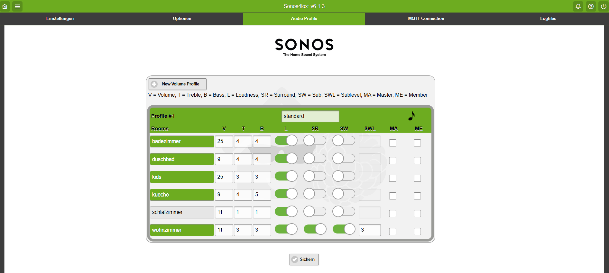
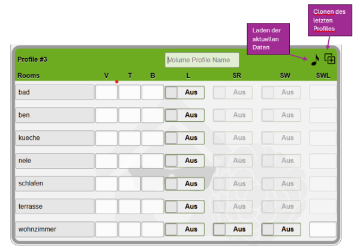

# Sound-Profile

## Definition

Sound Profile (Tab "**Audio Profile**") sind reine Audio Profile die zur klangtechnischen Optimierung von Streaming Diensten genutzt werden können. Es können beliebig viele Profile im Plugin angelegt werden, die anschließend in der Syntax für Playlisten/Radio/Streaming/T2S genutzt werden können. Es spielt keine Rolle ob sich die Player in einer Gruppe befinden oder als Single Player.

Je Player und Profil können folgende Einstellungen vorgegeben werden:

| Spalte | Einstellung | Werte |
| --- | --- | --- |
| **V** | Volume | 0 bis 100 |
| **T** | Höhen (Treble) | -10 bis 10 |
| **B** | Bass | -10 bis 10 |
| **L** | Loudness | Ein/Aus |
| **SR** | Surround | Ein/Aus (_falls ein Surround-System konfiguriert_) |
| **SW** | Subwoofer | Ein/Aus (_falls Subwoofer vorhanden_) |
| **SWL** | Subwoofer Level | -15 bis 15 |
| **MA** | Master | Der Master einer Gruppe von Playern (auch für T2S relevant) |
| **ME** | Member | Angeschlossene Member einer Gruppe (auch für T2S relevant) |

Ein Player kann nicht gleichzeitig Master und Member sein. Aus MA/ME ergibt sich automatisch der Typ des Profils (Gruppe, Single oder ohne Gruppierung); unvollständige Gruppierungen (z. B. Member ohne Master) werden als Fehler markiert.

 

:::info

Für **Text-to-speech** werden **nur die Volume-Einstellungen** (inkl. Gruppierung) des Profils genutzt.

:::

## Erstkonfiguration

Beim Erstaufruf des Tabs "Audio Profile" werden je Player die aktuellen Einstellungen/Werte ausgelesen und gespeichert. Um ein weiteres Profil zu erstellen auf "**New Audio Profile**" klicken, dann wird ein leeres Profil erstellt. Jedes Profil benötigt einen Namen; dieser wird in **Kleinbuchstaben** gespeichert und so auch in der Syntax verwendet. Um nicht wieder alles eingeben zu müssen kann man entweder:

  * _die aktuellen Einstellungen/Werte auslesen_ (**Musiknote**)
  * _das letzte gespeicherte Profil clonen und dann entsprechend anpassen_ (nur bei neuen Profilen)

Erfahrungsgemäß ist es einfacher die Einstellungen/Werte mit der Sonos App zu tätigen und wenn das abgeschlossen ist die getätigten Einstellungen mit Klick auf die **Musiknote** in ein (neues) Profil zu laden. Über den **Papierkorb** wird das aktuelle Profil gelöscht (nur möglich, wenn mehr als ein Profil existiert).

 

## Syntax für Ausgangsbefehle

Sämtliche Befehle (Query-String) sind an die relative URL des Plugins anzuhängen:
`/plugins/sonos4lox/index.php[Query-String]`

| Funktion | Query-String | Einzel | Gruppe | Beschreibung |
| --- | --- | :-: | :-: | --- |
| | `?zone=DEINE_ZONE&action=playradiofavorites&profile=<PROFIL NAME>` | **X** | | setzt das Profil beim Aufruf eines Streamingdienstes |
| | `?zone=DEINE_ZONE&member=ZONE1,ZONE2&action=playradiofavorites&profile=<PROFIL NAME>` | | **X** | setzt das Profil beim Streaming inkl. Group Member |
| | `?zone=kueche&action=say&text=Testsprachausgabe&profile=<PROFIL NAME>` | **X** | **X** | setzt die Volumeeinstellungen des Profils inkl. Gruppierungen für die T2S |

Der Parameter `&profile=` kann außerdem bei **sonosplaylist**, **playfavorite**, **playtrackfavorites**, **playplfavorites**, **playsonosplaylist**, **randomplaylist**, **pluginradio**, **nextpush**, **doorbell** sowie den Streaming-Diensten (**spotify**, **amazon**, **apple**, **napster**, **track**) verwendet werden.

Enthält das Profil selbst eine Gruppierung (MA/ME), wird die Gruppe aus dem Profil gebildet und `&member` darf nicht zusätzlich angegeben werden. Enthält das Profil keine Gruppierung, bestimmen `zone=` und `member=` die Player, das Profil liefert nur die Klangeinstellungen.

Die frühere eigenständige Aktion `action=profile` existiert nicht mehr (siehe [Entfernte Befehle](../03-integration/actions-extended.md#entfernte-befehle)).

:::warning

`&profile` und `&volume` dürfen **nicht** gemeinsam verwendet werden – der Befehl wird sonst mit einer Fehlermeldung im Log abgebrochen.

:::

:::note

Bei Nutzung der Autogruppierfunktion (MA mit/ohne ME) ist zu beachten, dass die Zone die in der Syntax (URL) angegeben wird nicht Teil dieser Gruppe wird!

:::
