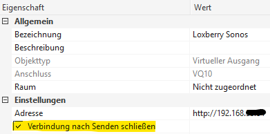
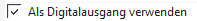
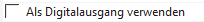

# T2S-Durchsagen

Die Grundeinstellungen für Text-to-speech (Engine, Stimme, Jingle) sind unter [Text-to-speech (T2S)](../01-getting-started/t2s.md) beschrieben.

:::warning

Virtuelle Ausgangsbefehle in Loxone müssen mit gesetztem Haken bei "**Verbindung nach dem Senden schließen**" angelegt werden, sonst wird die Funktion u. U. 2× ausgeführt.

 

:::

## An-/Abwesenheitssteuerung

Mit den Funktionen **absent** und **present** ist es möglich T2S-Durchsagen nur in Abhängigkeit von Anwesenheit auszugeben.

| Funktion | Befehl / Syntax | Beschreibung |
| --- | --- | --- |
| present | `/plugins/sonos4lox/index.php?zone=DEINE_ZONE&action=present` | T2S EIN (im MS bei HTTP Ein) |
| absent | `/plugins/sonos4lox/index.php?zone=DEINE_ZONE&action=absent` | T2S AUS (im MS bei HTTP Aus) |

## Allgemeine T2S-Parameter

Diese Parameter können bei **jeder** T2S optional kombiniert werden:

| Parameter | Syntax | Beschreibung |
| --- | --- | --- |
| volume | `&volume=40` | Setzt Lautstärke auf 40% |
| keepvolume | `&keepvolume` | Behält gegenwärtige Lautstärke bei |
| greet | `&greet` | Zufällige Grußformel vor der T2S; anpassbar über LoxBerry Translation Widget (Plugin: Sonos, Datei: `t2s-text_en.ini`, Sprache: German) |
| playgong | `&playgong=yes` | Spielt Standard-Jingle aus Plugin-Config vor der T2S ab |
| | `&playgong=Airport_gong` | Spielt angegebenes Jingle (ohne .mp3) aus `tts/mp3` ab |
| batch | `&batch` | Erzeugt T2S-MP3 für späteren Abruf |
| playbatch | `&playbatch` | Spielt alle mit `&batch` erstellten T2S in Reihenfolge ab |
| nocache | `&nocache` | Erzwingt Neu-Generierung der T2S trotz vorhandenem Cache |
| clip | `&clip` | Nutzt Sonos AudioClip: T2S wird in laufenden Stream eingemischt; optional: **`&paused`** (nur nicht spielende Player), **`&high`** (hohe Priorität) |
| urgent | `&urgent` | T2S wird auch bei ausgeschalteter T2S-Funktion ausgegeben |
| speaker | `&speaker=0` | Emotion der Piper-Stimme _Thorsten Emotional_ (0–7), siehe [Piper TTS](../01-getting-started/t2s.md#piper-tts-offline) |

## Einzel- und Gruppendurchsagen

Bei T2S **ohne** Loxone-Werte → Ausgangsbefehl als **Digital** markieren

 

| Befehl / Syntax | Einzel | Gruppe | Beschreibung |
| --- | :-: | :-: | --- |
| `/plugins/sonos4lox/index.php?zone=DEINE_ZONE&action=say&text=hallo. dies ist ein test` | **X** | | Einzeldurchsage |
| `/plugins/sonos4lox/index.php?zone=DEINE_ZONE&action=say&text=hallo&playgong=yes` | **X** | | Einzeldurchsage mit Standard-Jingle |
| `/plugins/sonos4lox/index.php?zone=DEINE_ZONE&action=say&text=hallo&voice=Hans&playgong=yes` | **X** | | Mit Jingle und Stimme Hans (nur Polly) |
| `/plugins/sonos4lox/index.php?zone=DEINE_ZONE&action=say&text=test&volume=20&greet&playgong=yes` | **X** | | Mit Jingle und Zufallsgrußformel |
| `/plugins/sonos4lox/index.php?zone=DEINE_ZONE&action=say&messageid=3&volume=30` | **X** | | Spielt Datei `3.mp3` aus `tts/mp3` ab |
| `/plugins/sonos4lox/index.php?zone=DEINE_ZONE&action=say&messageid=Gartentor_offen` | **X** | | Spielt `Gartentor_offen.mp3` aus `tts/mp3` ab |
| `/plugins/sonos4lox/index.php?zone=DEINE_ZONE&action=say&text=hallo&member=ZONE2,ZONE3` | | **X** | Gruppendurchsage auf 3 Zonen (Standard-Lautstärke) |
| `/plugins/sonos4lox/index.php?zone=DEINE_ZONE&action=say&text=hallo&member=ZONE2,ZONE3&volume=40` | | **X** | Gruppendurchsage mit Volume 40% |
| `/plugins/sonos4lox/index.php?zone=DEINE_ZONE&action=say&messageid=haustuer_offen&member=ZONE2` | | **X** | MP3-Datei auf 2 Playern |
| `/plugins/sonos4lox/index.php?zone=DEINE_ZONE&action=say&messageid=haustuer_offen&profile=gruppe1` | | **X** | MP3-Datei auf allen Playern des [Sound-Profils](../02-configuration/sound-profiles.md) gruppe1 |
| `/plugins/sonos4lox/index.php?zone=DEINE_ZONE&action=say&text=hallo&member=all` | | **X** | Gruppendurchsage auf **allen** Zonen |

:::note

Eine Zone darf in der Syntax nur einmal vorkommen, also nicht gleichzeitig in `zone=` und `member=`.

:::

## T2S mit Loxone-Werten (`<v>`)

Bei T2S **mit** Loxone-Werten → Ausgangsbefehl als **Analog** markieren

 

| Befehl / Syntax | Einzel | Gruppe | Beschreibung |
| --- | :-: | :-: | --- |
| `/plugins/sonos4lox/index.php?zone=DEINE_ZONE&action=say&text=Die Temperatur betraegt <v> Grad` | **X** | | Gibt Wert **`<v>`** des MS-Bausteins aus |
| `/plugins/sonos4lox/index.php?zone=DEINE_ZONE&action=say&text=Temperatur: <v> Grad&member=2.ZONE,3.ZONE&volume=40` | | **X** | Wert auf 3 Playern mit Volume 40% |
| `/plugins/sonos4lox/index.php?zone=DEINE_ZONE&action=say&text=<v>&volume=40` | **X** | **X** | T2S aus Statusbaustein; gesamter Text inkl. Variablen im Statusbaustein. **Kein Zeilenumbruch am Textende!** |

Beispiel Statusbaustein (Pooltemperatur mit 1 Dezimalstelle an AI1): Statustext = `Die aktuelle Pooltemperatur ist <v1.1> Grad`

## T2S aus Statusbaustein (PicoC)

Um doppelte T2S-Ausgabe beim Ein-/Ausschalten eines Triggers zu vermeiden, empfiehlt sich ein PicoC-Programmbaustein als Zwischenschicht. Aufbau: Ausgang TQ des Statusbausteins → TIx des PicoC-Bausteins; Trigger → AIx; T2S-HTTP-Ausgang → TQx.

```c title="PicoC"
float f1, f2, f3;
int nEvents;
char* Text;
while(TRUE)
 {
 nEvents = getinputevent();
 if (nEvents & 0x38) // 4er Pico = 0xe, 8er Pico = 0x1c, 16er Pico = 0x38
 {
 f1 = getinput(0);
 if (f1 == 1) { Text = getinputtext(0); setoutputtext(0,Text); }
 f2 = getinput(1);
 if (f2 == 1) { Text = getinputtext(1); setoutputtext(1,Text); }
 f3 = getinput(2);
 if (f3 == 1) { Text = getinputtext(2); setoutputtext(2,Text); }
 }
 sleep(100);
 }
```

Ab Version 9 der Loxone Config steht nur noch der 16er Baustein zur Verfügung → `0x38` verwenden.

## Sonderfunktionen T2S

| Funktion | Befehl / Syntax | Einzel | Gruppe | Beschreibung |
| --- | --- | :-: | :-: | --- |
| Türklingel | `/plugins/sonos4lox/index.php/?zone=DEINE_ZONE&action=doorbell&file=chime` | **X** | **X** | Sonos-Built-in-Klingelton oder MP3 aus `tts/mp3` (ohne .mp3); optional: **`&paused`** für nicht spielende Player, **`&volume=30`**, **`&member=<ZONE1,ZONE2 oder all>`** |
| Uhrzeit | `/plugins/sonos4lox/index.php?zone=DEINE_ZONE&action=say&clock` | **X** | | Aktuelle LoxBerry-Uhrzeit wird angesagt |
| Wetter | `/plugins/sonos4lox/index.php?zone=DEINE_ZONE&action=say&weather` | **X** | **X** | Wettervorhersage/-status (benötigt weather4lox Plugin) |
| Abfall | `/plugins/sonos4lox/index.php?zone=DEINE_ZONE&action=say&abfall` | **X** | **X** | Nächster Abfalltermin (benötigt CalDAV4lox Plugin) |
| Pollen | `/plugins/sonos4lox/index.php?zone=DEINE_ZONE&action=say&pollen` | **X** | **X** | Pollenflughinweis |
| Wetterwarnung | `/plugins/sonos4lox/index.php?zone=DEINE_ZONE&action=say&warning` | **X** | **X** | Aktuelle Wetterwarnung (Bundesland und Gemeinde muss in Plugin-Config gepflegt sein) |
| Titel/Interpret | `/plugins/sonos4lox/index.php?zone=DEINE_ZONE&action=say&sonos` | **X** | | Aktuell laufenden Titel/Interpret oder Radiosender ansagen |
| Radiosender | `/plugins/sonos4lox/index.php?zone=DEINE_ZONE&action=saysonos` | **X** | | Aktuell laufenden Radiosender per T2S ausgeben |
| Fahrzeit | `/plugins/sonos4lox/index.php?zone=DEINE_ZONE&action=say&distance&to=Hamburg&traffic` | **X** | **X** | Fahrzeit via Google (API Key erforderlich); Parameter: **`&traffic`**, **`&model=pessimistic/best_guess/optimistic`**, **`&deptime=16:30`** |
| mp3rights | `/plugins/sonos4lox/index.php?zone=DEINE_ZONE&action=mp3rights` | | **X** | Setzt Rechte für TTS-Verzeichnis auf 0755 (repariert Abspielprobleme bei messageid) |

:::tip

Für wiederkehrende Ansagen können vorgefertigte MP3-Dateien genutzt werden, siehe [Tipps & Tricks](../04-misc/tips.md).

:::
