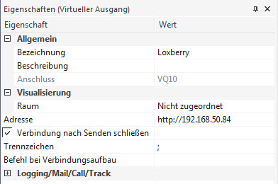
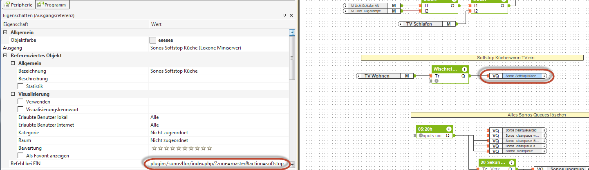
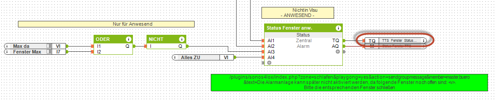
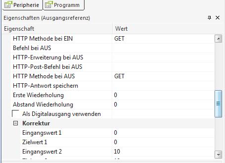

# Loxone-Anbindung

## Ausgangsseitig (Miniserver → Sonos)

Um die Sonos Installation vom Miniserver aus zu steuern muss für jede Aktivität ein virtueller Ausgangsbefehl angelegt werden. Dieser kann jeweils bei Ein oder Aus eine Funktion aufrufen.

Folgende Aktivitäten müssen in Loxone durchgeführt werden:

  1. virtuellen Ausgang anlegen
  2. virtuellen Ausgangsbefehl anlegen
  3. zu verwendende Syntax in virtuellen Ausgangsbefehl erstellen/kopieren (siehe [Standard-Befehle](./actions-default.md), [Playlisten / Radio](./actions-playback.md), [T2S-Durchsagen](./actions-t2s.md) und [Sonstige Befehle](./actions-extended.md))

### Virtuellen Ausgang anlegen

Falls nicht schon für andere Plugins vorhanden, einen virtuellen Ausgang anlegen und die IP-Adresse deines LoxBerry eintragen:

 

### Virtuellen Ausgangsbefehl anlegen

Bsp.: Befehl bei EIN: Wenn der TV im Wohnzimmer eingeschaltet wird, soll die Zone "Küche" zügig auf Lautstärke Null runtergeregelt werden und dann stoppen.

 

### Virtuellen Ausgangsbefehl mit Werten aus Loxone anlegen

Bsp.: Ansage des Fensterstatus beim Einschalten der Alarmanlage. Der Wert `<v>` wird aus dem Wert des Statusbausteins übernommen.

 

Wichtig ist, dass der Ausgangsbefehl als **analog** markiert sein muss, d.h. Haken bei "**Als Digitalausgang verwenden**" rausnehmen:

 

## Eingangsseitig (Sonos → Miniserver)

:::info[Miniserver]

Die eingangsseitigen Daten werden NUR an den im Plugin selektierten Miniserver gesendet.

:::

Die Daten werden, sobald eine Status Änderung an einer Zone stattfindet, nahezu in Real Time vom Sonos Event Listener des Plugins gesendet. Die Übertragung wird in den [T2S-/Grundeinstellungen](../01-getting-started/t2s.md#weitere-einstellungen) unter "Ausgehende Datenübertragung" aktiviert. Es gibt drei Wege:

  * **MQTT** (immer): über den LoxBerry MQTT Gateway, Topics siehe [MQTT](../02-configuration/mqtt.md)
  * **UDP** (nur wenn ein UDP-Port konfiguriert ist): direkt an den Miniserver
  * **HTTP** (virtuelle Texteingänge): Titel, Interpret, Album, Radiosender, Cover sowie Infos zum nächsten Titel

Am einfachsten ist es eines der beiden vorkonfigurierten XML Templates `VI_MQTT_UDP_Sonos.xml` bzw. `VI_UDP_Sonos.xml` (nur verfügbar wenn ein UDP-Port konfiguriert ist) zu nutzen, welche die gängigen Informationen enthalten. Diese können in der Plugin-Konfiguration unter "**Download XML-Template für Loxone Import**" heruntergeladen und anschließend in Loxone Config importiert werden. Zusätzlich können noch andere Informationen genutzt werden. Details dazu findet man in der Plugin-Konfiguration über "**INFO detaillierte Informationen**".

### UDP

Jeder Wert wird als eigenes Paket im Format `s4lox: <Raum>_<Key>@<Wert>` gesendet. Es werden nur geänderte Werte übertragen; alle 5 Minuten bzw. nach einem Neustart des Miniservers werden alle Werte erneut gesendet.

| Key | Bedeutung |
| --- | --- |
| `state_code` | 1 = Play, 2 = Pause, 3 = Stop, 4 = Wechsel |
| `volume`, `mute` | Lautstärke, Stummschaltung (1/0) |
| `group_role` | 1 = Single, 2 = Master, 3 = Member |
| `current_source` | 0 = nichts, 1 = Radio, 2 = Playlist/Stream, 3 = TV, 4 = Line-In |
| `tvstate` | TV-Status |
| `bass`, `treble`, `loudness`, `balance`, `subgain`, `nightmode`, `dialoglevel` | Klangeinstellungen |
| `shuffle`, `repeat`, `repeat_one`, `crossfade`, `playmode_code` | Wiedergabemodus |
| `position_sec`, `duration_sec`, `progress_pct`, `track_no`, `track_count` | Wiedergabeposition |

Zusätzlich: `online_players`, `offline_players`, `total_players` und `<Raum>_online`.

### HTTP (virtuelle Texteingänge)

Folgende virtuelle Texteingänge werden je Raum befüllt: `s4lox_<Raum>_current_title`, `_current_artist`, `_current_album`, `_current_titint`, `_current_radio`, `_current_cover`, `s4lox_<Raum>_next_title`, `_next_artist`, `_next_album`, `_next_cover`, `_next_uri` sowie `s4lox_<Raum>_volume`, `_mute` und `_state_code`.

### T2S-Status

Während einer T2S-Durchsage wird für die Zone **1**, nach Ende **0** gesendet:

  * ohne UDP-Port: MQTT `s4lox/t2s/<Zone>` (bzw. `Sonos4lox/t2s/<Zone>`)
  * mit UDP-Port: virtueller Eingang `t2s_<Zone>` per HTTP sowie UDP `s4lox: t2s_<Zone>@<Wert>`

Weitere Daten: [Sonos Wecker / Alarme](../05-features/alarms.md), [Firmware-Update](../05-features/firmware-update.md).
