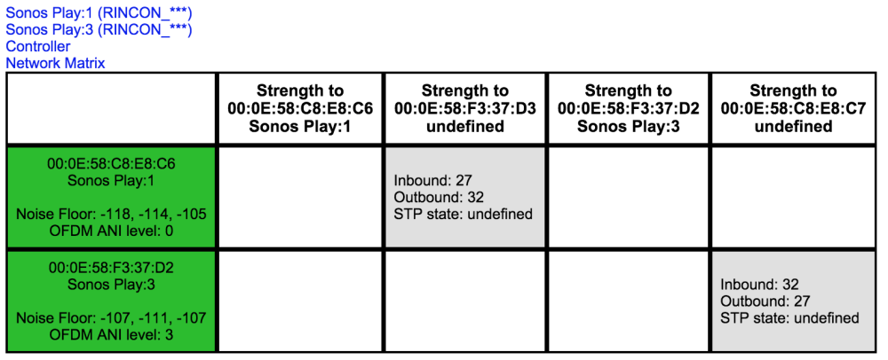
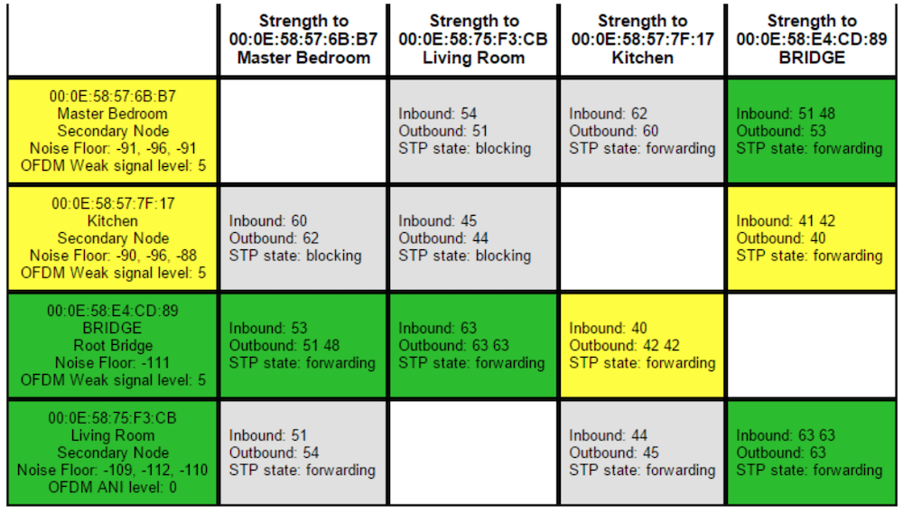

# Sonos Network Matrix

## Analyse

Da es unter Umständen zu Verbindungsproblemen bzw. -latenzen kann hier einige Infos um ggf. die WiFi-Performance zu überprüfen und zu optimieren. Eine Übersicht bzgl. der WiFi-Details folgenden Befehl im Browser eingeben:

> http://\<IP SONOS DEVICE>:1400/support/review

anschließend auf "**Network Matrix**" klicken

## Sonos Network Matrix mit guten Verbindungen

## Sonos Network Matrix mit Optimierungspotential

Das kann natürlich auch anders aussehen als beim obigen Bild. Genau dann hilft das Sonos Web-Interface eben weiter und bietet die Möglichkeit das Netzwerk zu optimieren. Die Matrix liest sich wie folgt: Grüne Felder zeigen eine gute Signalverbindung, graue Felder zeigen Sonos-Module die nicht **drahtlos** miteinander kommunizieren (etwa kabelgebundene Einheiten), gelbe und rote Felder weisen auf eher schlechte Funkverbindungen hin.

Optimieren kann man nämlich hauptsächlich an zwei Punkten: Einerseits am verwendeten WLAN Kanal und andererseits bei der Wahl der Root Bridge.