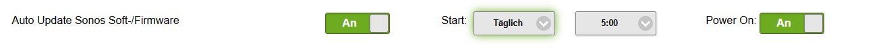
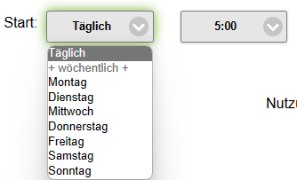

# Auto-Update Sonos Firmware

_Ab v5.5.0._ Das Plugin prüft je Player ob ein Firmware-Update verfügbar ist und führt es automatisch durch. Die Updatefrequenz ist in den [Optionen](../02-configuration/options.md#auto-update-sonos-firmware) konfigurierbar. Option "**Power On**": ausgeschaltete Player vor dem Update einschalten und danach wieder ausschalten.

 
 

Voraussetzung: aktivierte **MQTT** oder **UDP** Kommunikation zum Miniserver (siehe [Loxone-Anbindung](../03-integration/loxone.md#eingangsseitig-sonos--miniserver)).

| Protokoll | Eingangs-Syntax im MS | Wert |
| --- | --- | --- |
| MQTT | `Sonos4lox_update` | 1 oder 0 |
| UDP | `Sonos4lox: update` | 1 oder 0 |
