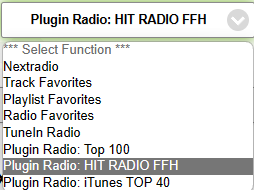

# Follow-me (Präsenzerkennung)

Ermöglicht, dass ein Player automatisch den Stream eines "Host Players" übernimmt, sobald ein Raum betreten wird (z. B. per Bewegungsmelder). Der Standard-Host und der Nachlauf werden in den [Optionen](../02-configuration/options.md#follow-me-präsenzerkennung) konfiguriert.

## Voraussetzungen

  * Auf dem Player des betretenen Raumes ist **kein** Stream aktiv
  * Auf dem Host Player läuft **kein** TV
  * Host und Client (betretener Raum) sind unterschiedliche Player

## Befehle

Befehle am Bewegungsmelder-Ausgangsverbinder:

| Funktion | Befehl | Beschreibung |
| --- | --- | --- |
| follow | `/plugins/sonos4lox/index.php/?zone=<PLAYER>&action=follow` | Befehl bei EIN → folgt dem Host Player |
| leave | `/plugins/sonos4lox/index.php/?zone=<PLAYER>&action=leave` | Befehl bei AUS → verlässt den Stream nach Ablauf des Nachlaufs |

## Optionale Parameter

| Parameter | Befehl | Beschreibung |
| --- | --- | --- |
| volume | `&action=follow&volume=12` | Einschaltlautstärke für den Client |
| play | `&action=follow&play` | Falls kein Stream auf Host: Client mit play starten (Queue/Sender muss vorhanden sein) |
| host | `&action=follow&host=<PLAYER>` | Überschreibt den Standard-Host aus der Config (Pflicht, wenn kein Host konfiguriert ist) |
| function | `&action=follow&function` | Falls kein Stream auf Host: die [Folgefunktion](../02-configuration/options.md#folgefunktion-für-zapzone-u-follow) aus der Plugin-Config starten (inkl. Radio-Favoriten) |
| delay | `&action=leave&delay=60` | Überschreibt den Nachlauf (Sekunden) aus der Config (Pflicht, wenn kein Nachlauf konfiguriert ist) |

 

:::note

`&play` und `&function` können nicht kombiniert werden; alle anderen Parameter sind kombinierbar.

:::
